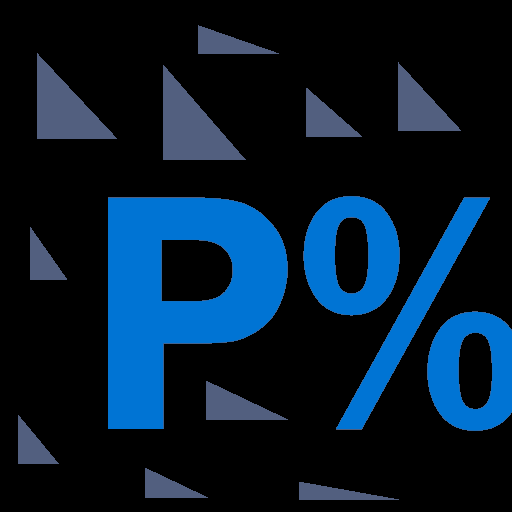

# The Predictability Score™ (FSR)

> **"Stop gambling on volatility. Identify the floor so you can build on solid ground."**

The **Predictability Score** is an institutional-grade analytics engine that quantifies the stability of any dataset—from NBA player props to pharmaceutical manufacturing lines. Unlike standard deviation, which merely measures spread, our engine measures **consistency relative to trend**, providing a single, actionable score (0-100%).



---

## 🚀 Features

### 1. The Core Engine (`fsr.py`)
*   **Proprietary Algorithm:** Uses a modified Coefficient of Variation (CV) combined with an exponential decay function.
*   **The K-Factor™:** A tunable sensitivity knob that adjusts the algorithm for different domains:
    *   `k=0.5` (Sports): Forgiving of occasional bad games.
    *   `k=2.0` (Finance): Strict punishment for volatility.
    *   `k=15.0` (Pharma): Zero-tolerance for deviation.

### 2. Sliding Window Analysis (`sliding_window.py`)
*   **Temporal Drift Detection:** Instead of a static score, this feature scans the dataset with a moving window to detect *when* a process started to fail.
*   **High-Performance Computing:** Powered by **Numba** (`@jit`) to compile Python into machine code, allowing it to process thousands of windows in milliseconds.

### 3. The Platform
*   **SaaS Architecture:** Built on **Flask** with a **PostgreSQL** backend.
*   **Monetization:** Integrated **Stripe** payments with tiered access (Free, Pro, Business API).
*   **Developer API:** A RESTful API for B2B clients to integrate stability scoring into their own dashboards.

---

## 🛠️ Tech Stack

*   **Backend:** Python 3.10+, Flask
*   **Math:** NumPy, Numba (JIT Compilation)
*   **Database:** PostgreSQL (Production), SQLite (Dev)
*   **Frontend:** HTML5, CSS3 (Dark Mode), Chart.js
*   **Infrastructure:** Gunicorn, Render (Deployment)

---

## 📦 Installation

1.  **Clone the repository:**
    ```bash
    git clone https://github.com/OG-sus/predictability_percentage.git
    cd predictability_percentage
    ```

2.  **Create a virtual environment:**
    ```bash
    python -m venv venv
    source venv/bin/activate  # On Windows: venv\Scripts\activate
    ```

3.  **Install dependencies:**
    ```bash
    pip install -r requirements.txt
    ```

4.  **Set up the database:**
    ```bash
    python init_db.py
    ```

5.  **Run the server:**
    ```bash
    python api.py
    ```
    Visit `http://127.0.0.1:5000` in your browser.

---

## 📊 Usage Examples

### Python (Internal Script)
```python
from fsr import calculate_predictability

data = [10, 12, 11, 10.5, 11.2]
score = calculate_predictability(data, k=1.0)
print(f"Stability Score: {score:.2f}%")
```

### API (cURL)
```bash
curl -X POST https://predictability-api.com/api/v1/calculate \
-H "Authorization: Bearer YOUR_API_KEY" \
-H "Content-Type: application/json" \
-d '{"scores": [10, 12, 11, 10.5], "k": 2.0}'
```

---

## 📂 Project Structure

*   `api.py`: Main Flask application and route definitions.
*   `fsr.py`: Core mathematical logic.
*   `sliding_window.py`: Numba-optimized windowing functions.
*   `templates/`: HTML frontend files.
*   `static/`: CSS, Images, and JS assets.
*   `nba_data_gen.py`: Internal tool for generating sports marketing content.

---

## 📜 License

Proprietary Software. All rights reserved.
© 2026 Predictability API.
